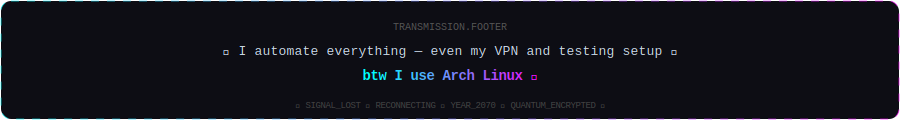

<!-- ╔══════════════════════════════════════════════════════════════╗ -->
<!-- ║          YEAR 2070 — NEURAL INTERFACE ACTIVATED             ║ -->
<!-- ╚══════════════════════════════════════════════════════════════╝ -->

<div align="center">

<!-- ANIMATED HEADER BANNER -->


<!-- ANIMATED CAPSULE RENDER -->


<!-- TYPING ANIMATION -->
<a href="https://git.io/typing-svg"></a>

<br/>

<!-- PROFILE BADGE ROW -->

&nbsp;
<a href="https://discord.gg/772131084896698400"></a>
&nbsp;
<a href="https://linkedin.com/in/abbas-samaha"></a>

</div>

<!-- ═══════════════ DIVIDER ═══════════════ -->


<!-- ▓▓▓▓▓▓▓▓▓▓ ABOUT SECTION ▓▓▓▓▓▓▓▓▓▓ -->

<div align="center">

</div>

<br/>

<div align="center">
<table>
<tr>
<td width="50%">

```yaml
# ╔═══════════════════════════════╗
# ║   COLLABORATION PROTOCOLS    ║
# ╚═══════════════════════════════╝

looking_to_collaborate:
  - Open-source QA automation tools
  - Cloud-based VPN & DevOps projects
  - Performance testing dashboards

looking_for_help:
  - VPN connection optimization
  - Advanced monitoring pipelines

ask_me_about:
  - VPN infrastructure
  - QA & performance testing
  - K6, Grafana, Linux, Python
  - Cloud & DevOps automation
```

</td>
<td width="50%">

```js
// ╔═══════════════════════════════╗
// ║   SYSTEM_DIAGNOSTICS v7.2    ║
// ╚═══════════════════════════════╝

const SamahaAbbas = {
  role: "DevOps & QA Engineer",
  code: ["Python", "TypeScript", "C++",
         "Bash"],
  os: "Arch Linux 🐧",
  tools: {
    testing:  ["Robot Framework",
               "Selenium", "Playwright"],
    devops:   ["Docker", "GitHub Actions",
               "AWS"],
    monitor:  ["K6", "Grafana"],
    vpn:      ["OpenVPN", "WireGuard",
               "V2Ray", "Shadowsocks"],
  },
  motto: "Automate everything ⚡",
};
```

</td>
</tr>
</table>
</div>

<!-- ═══════════════ DIVIDER ═══════════════ -->


<!-- ▓▓▓▓▓▓▓▓▓▓ TECH STACK ▓▓▓▓▓▓▓▓▓▓ -->


<div align="center">

#### `⟨ LANGUAGES ⟩`


#### `⟨ TESTING _ QA ⟩`


#### `⟨ DEVOPS _ CLOUD ⟩`


#### `⟨ FRAMEWORKS _ TOOLS ⟩`


</div>

<!-- ═══════════════ DIVIDER ═══════════════ -->


<!-- ▓▓▓▓▓▓▓▓▓▓ GITHUB STATS ▓▓▓▓▓▓▓▓▓▓ -->


<div align="center">

<!-- STREAK STATS -->


<br/><br/>

<!-- ACTIVITY GRAPH -->


</div>

<!-- ═══════════════ DIVIDER ═══════════════ -->


<!-- ▓▓▓▓▓▓▓▓▓▓ QUANTUM TELEMETRY ▓▓▓▓▓▓▓▓▓▓ -->

<div align="center">

</div>

<!-- ═══════════════ DIVIDER ═══════════════ -->


<!-- ▓▓▓▓▓▓▓▓▓▓ QUOTE ▓▓▓▓▓▓▓▓▓▓ -->

<div align="center">


</div>

<!-- ═══════════════ DIVIDER ═══════════════ -->


<!-- ▓▓▓▓▓▓▓▓▓▓ FOOTER ▓▓▓▓▓▓▓▓▓▓ -->

<div align="center">


<br/><br/>

<!-- SUPPORT -->
<a href="https://ko-fi.com/abbassamaha"></a>

<br/><br/>

<!-- BOTTOM CAPSULE -->


</div>
